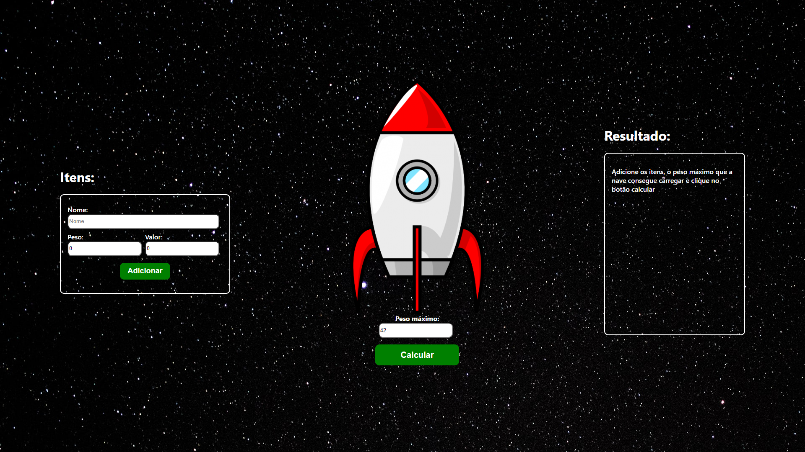
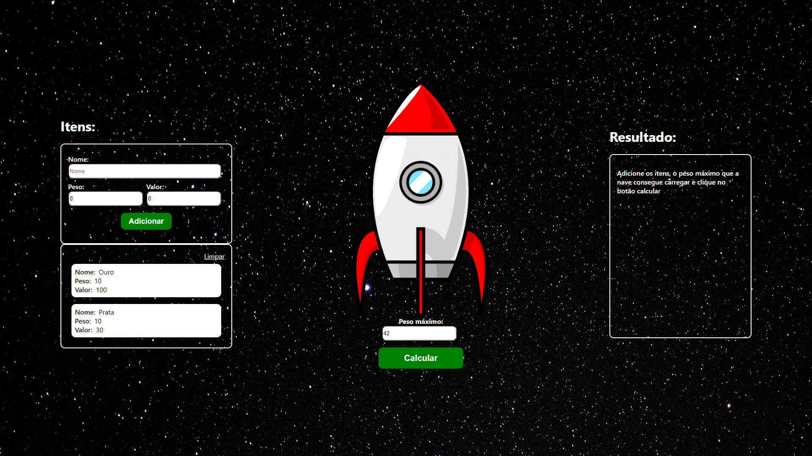
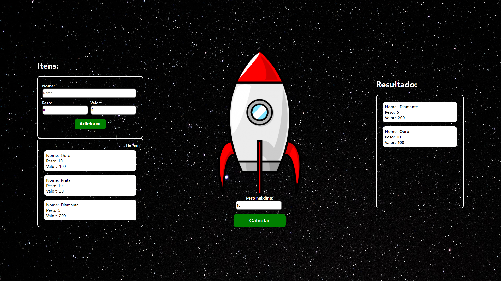

Temas:
 - Greed

# Greed - Mochileiro das Galáxias


**Número da Lista**: 3<br>
**Conteúdo da Disciplina**: Greed Algorithms<br>

## Alunos
|Matrícula | Aluno |
| -- | -- |
| 16/0120918 |  Gabriel de Jesus Carvalho |
| 18/0054554  |  	Paulo Batista |

## Sobre 
É um site que visa ajudar um mochileiro das galáxias a maxímizar os seus ganhos, otimizando seu trabalho, para que ele consiga carregar os itens que darão maior recompensa a ele, baseado na quantidade de peso que sua nave consegue carregar.

## Screenshots




## Instalação 
**Linguagem**: JavaScript<br>
**Framework**: React<br>
Para rodar o projeto é necessário ter o [NodeJs](https://nodejs.org/en/) e o [Yarn](https://yarnpkg.com/) instalados.

Para instalar as dependências: 

```
  yarn install
```
Para executar o projeto: 

```
  yarn start
```

## Uso 
Basta adicionar os itens que deseja carregar, adicionar o peso máximo que a nave consegue carregar e clicar em calcular. Após isso o resultado será gerado ao lado.


